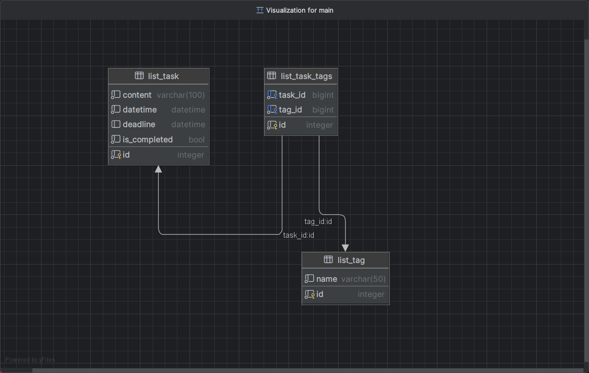

# TODO

Django project for managing Tasks


## Installation

Python3 must be already installed 

```shell
git clone https://github.com/sind14/CateringDBSystem
cd TODO
python3 -m venv venv 
source venv/bin/activate
pip install -r reguirements.txt 
python manage.py runserver # starts Django Server 
```

## Features 
 
* Managing Tasks & Tags directly from website interface 

## Diagram


